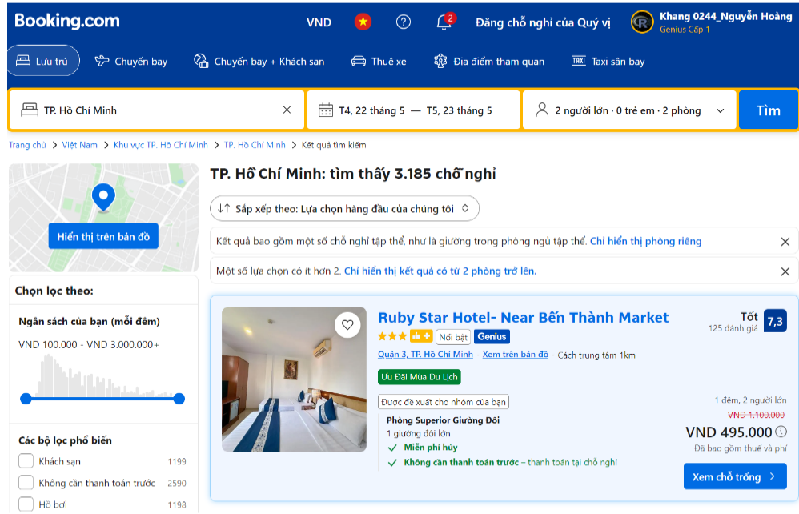

# 🏨 Booking.com Hotel Analytics: A Comprehensive ML Analysis

<div align="center">
  <!-- Banner chính -->
  
  
  <!-- Badges -->
  <p>
    
    
    
  </p>
</div>

## 📝 Overview

A comprehensive machine learning analysis of hotel data scraped from Booking.com in Ho Chi Minh City, Vietnam. This project leverages various ML techniques to extract insights from hotel reviews, images, and metadata to provide actionable intelligence for the hospitality industry.

## 🎯 Key Objectives

1. **Predictive Analytics**: Develop robust models for review score prediction
2. **Market Segmentation**: Identify distinct hotel segments using unsupervised learning
3. **Quality Classification**: Create a reliable hotel quality classification system
4. **Image Analysis**: Incorporate visual data in prediction models

## 🛠️ Technical Implementation

### 1. Review Score Regression
- **Combined Model Architecture**:
  - ResNet18 backbone for image feature extraction
  - Fusion with numerical/categorical features
  - Custom head for regression
- **Traditional ML Approach**:
  - Ridge Regression with VIF-based feature selection
  - Hyperparameter optimization via cross-validation
  - RMSE-focused model evaluation

### 2. Hotel Segmentation (Unsupervised Learning)
- **Clustering Algorithms**:
  - K-means for basic segmentation
  - DBSCAN for density-based clustering
- **Evaluation Metrics**:
  - Silhouette Score
  - Elbow Method for optimal cluster selection

### 3. Quality Classification
- **Multi-class Classification**:
  - Softmax Regression baseline
  - Stacking Ensemble:
    - Base models: SVM, KNN, Decision Tree, Random Forest
    - Meta-model: Logistic Regression
- **Class Definition**:
  ```python
  def quality_mapping(score):
      if score < 7.0:
          return "Standard"      # Basic amenities, lower prices
      elif score < 9.0:
          return "Superior"      # Good quality, competitive pricing
      else:
          return "Exceptional"   # Premium experience, luxury segment
  ```

## 🚀 Getting Started

### Prerequisites
bash
python 3.8+
pytorch 1.9+
scikit-learn 0.24+
pandas 1.3+
numpy 1.19+

### Installation
```bash
git clone https://github.com/username/booking-hotel-analysis.git
cd booking-hotel-analysis
pip install -r requirements.txt
```

### Model Training & Evaluation

1. **Regression Models**
```bash
# Deep Learning Approach
python evaluate.py \
    --task_type regression \
    --model_type dl \
    --dataset 'booking_images' \
    --n_epoch 5 \
    --batch_size 32 \
    --lr 0.01 \
    --save_model

# Traditional ML Approach
python evaluate.py \
    --task_type regression \
    --model_type ml \
    --model Vanilla_LinearRegression \
    --vif_threshold 5.0
```

2. **Classification Models**
```bash
# Stacking Ensemble
python evaluate.py \
    --task_type classification \
    --model_type ml \
    --model Ensemble \
    --save_model
```

3. **Clustering Analysis**
```bash
python evaluate.py \
    --task_type clustering \
    --model_type ml \
    --model KMeans \
    --save_model
```

## 📊 Data Architecture

```plaintext
project/
├── data/
│   ├── raw/                  # Raw scraped data
│   ├── processed/            # Cleaned & preprocessed data
│   └── hotel_images/         # Hotel image repository
├── models/
│   ├── regression/          
│   ├── classification/
│   └── clustering/
├── notebooks/               # Analysis & experimentation
└── src/                    # Source code
```

### Key Features
| Feature | Type | Description |
|---------|------|-------------|
| review_score | float | Rating (0-10) |
| price | float | Room price (VND) |
| facilities | list | Available amenities |
| location | str | Hotel location |
| images | tensor | Processed hotel images |

## 📈 Performance Metrics

### Regression Task
- RMSE: 0.85
- R²: 0.78
- MAE: 0.67

### Classification Task
- Accuracy: 0.84
- F1-Score: 0.82
- ROC-AUC: 0.89

### Clustering Analysis
- Silhouette Score: 0.76
- Optimal Clusters: 3

## 🔍 Future Improvements

1. **Model Enhancements**:
   - Implement attention mechanisms for image analysis
   - Explore transformer architectures
   - Incorporate temporal features

2. **Feature Engineering**:
   - Develop more sophisticated text features
   - Create location-based features
   - Extract deeper image features

## 🤝 Contributing

We welcome contributions! Please see our [Contributing Guidelines](CONTRIBUTING.md) for details.

## 📝 License

This project is licensed under the MIT License - see the [LICENSE](LICENSE) file for details.

## 📚 Citation

If you use this work in your research, please cite:

```bibtex
@misc{booking_analysis_2024,
  author = {Your Name},
  title = {Booking.com Hotel Analytics},
  year = {2024},
  publisher = {GitHub},
  url = {https://github.com/khang3004/Comprehensive-ML-DL-Approaches-for-Hotel-Room-Review-Score-Prediction.git}
}
```

## 📧 Contact

For any queries, please reach out to [gausseuler159357@gmail.com](KhangDS)