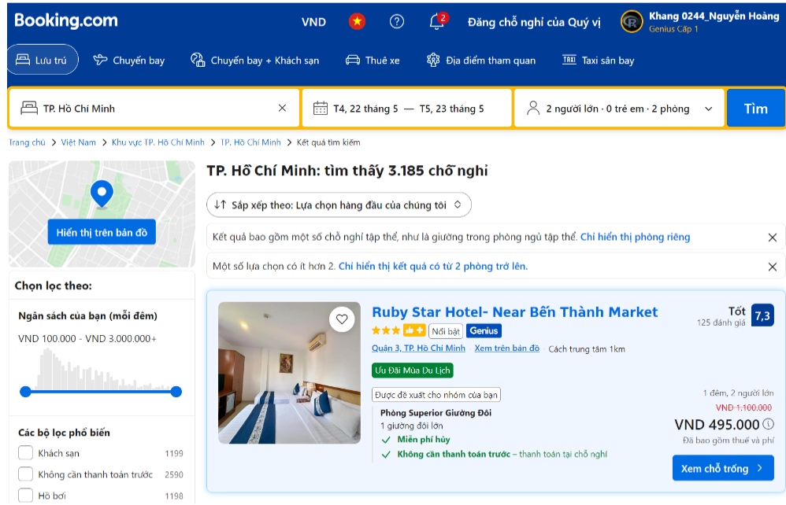

# 🏨 Booking.com Hotel Analytics: Professional ML/DL System

<div align="center">
  
  
  <p>
    
    
    
    
    
    
  </p>
</div>

## 📋 Table of Contents

- [Overview](#-overview)
- [Features](#-features)
- [Quick Start](#-quick-start)
- [Installation](#-installation)
- [Project Structure](#-project-structure)
- [Usage Guide](#-usage-guide)
- [Configuration](#-configuration)
- [Model Zoo](#-model-zoo)
- [Results & Performance](#-results--performance)
- [Docker Deployment](#-docker-deployment)
- [Development](#-development)
- [Contributing](#-contributing)
- [License](#-license)

---

## 🎯 Overview

A **production-grade** machine learning system for comprehensive hotel analytics using data from Booking.com in Ho Chi Minh City, Vietnam. This project implements state-of-the-art ML/DL techniques with a focus on:

- **Clean Architecture**: Modular, maintainable, and extensible codebase
- **Best Practices**: Type hints, logging, testing, CI/CD
- **Reproducibility**: Configuration management with Hydra, experiment tracking with MLflow
- **Scalability**: Docker containerization, efficient data pipelines

### Key Business Objectives

1. **Predictive Analytics**: Accurate review score prediction using multi-modal data
2. **Market Segmentation**: Data-driven hotel clustering for strategic insights
3. **Quality Classification**: Automated hotel quality assessment
4. **Visual Intelligence**: CNN-based image feature extraction and analysis

---

## ✨ Features

### 🔧 Technical Features

- **Multi-Modal Learning**: Combine tabular data with image features
- **Ensemble Methods**: Stacking classifiers for improved accuracy
- **Automated Hyperparameter Tuning**: Grid search and Bayesian optimization
- **Cross-Validation**: K-fold CV with stratification
- **Feature Engineering**: VIF-based feature selection, automated preprocessing
- **Experiment Tracking**: MLflow integration for reproducibility
- **Configuration Management**: Hydra for flexible config overrides
- **Logging**: Structured logging with rotating file handlers

### 📊 Model Capabilities

| Task | Models | Metrics |
|------|--------|---------|
| **Regression** | Ridge, ElasticNet, DL (ResNet18 + FC) | RMSE, R², MAE |
| **Classification** | SVM, RF, XGBoost, Stacking Ensemble | Accuracy, F1, ROC-AUC |
| **Clustering** | KMeans, DBSCAN, Hierarchical | Silhouette, Davies-Bouldin |
| **Time Series** | ARIMA, Prophet | MAPE, MASE |

---

## 🚀 Quick Start

### Prerequisites

```bash
Python >= 3.9
CUDA >= 11.7 (optional, for GPU acceleration)
Git
Docker (optional)
```

### Installation (5 minutes)

```bash
# Clone repository
git clone https://github.com/khang3004/Comprehensive-ML-DL-Approaches-for-Hotel-Room-Review-Score-Prediction.git
cd Comprehensive-ML-DL-Approaches-for-Hotel-Room-Review-Score-Prediction

# Create virtual environment
python -m venv venv
source venv/bin/activate  # Linux/Mac

# Install dependencies
pip install -r requirements.txt

# Verify installation
python -m pytest tests/ -v
```

### Run Your First Experiment

```bash
# Regression with Deep Learning
python src/tasks/regression/run.py task_type=regression model=dl_regression epochs=50

# Classification with Ensemble
python src/tasks/classification/run.py task_type=classification model=stacking_ensemble

# Clustering Analysis
python src/tasks/clustering/run.py task_type=clustering model=kmeans n_clusters=3
```

---

## 📦 Installation

### Standard Installation

```bash
# Basic installation
pip install -e .

# Development installation (includes testing tools)
pip install -e ".[dev]"

# Full installation (includes all optional dependencies)
pip install -e ".[all]"
```

### Docker Installation

```bash
# Build image
docker build -t booking-hotel-analytics:latest .

# Run with GPU support
docker run --gpus all -it \
  -v $(pwd)/data:/app/data \
  -v $(pwd)/models:/app/models \
  -v $(pwd)/results:/app/results \
  booking-hotel-analytics:latest
```

---

## 🏗️ Project Structure

```
booking-hotel-analytics/
├── src/                       # Source code (production-ready)
│   ├── core/                  # Core abstractions
│   ├── data/                  # Data pipeline
│   ├── models/                # Model architectures
│   ├── utils/                 # Utilities
│   └── tasks/                 # Task-specific scripts
├── configs/                   # Hydra configurations
├── tests/                     # Test suite
├── notebooks/                 # Jupyter notebooks
├── scripts/                   # Utility scripts
├── data/                      # Data directory
├── models/                    # Saved models
├── results/                   # Results & logs
├── logs/                      # Log files
├── .github/workflows/         # CI/CD pipelines
├── pyproject.toml             # Project metadata
├── setup.py                   # Package setup
├── requirements.txt           # Dependencies
├── Dockerfile                 # Docker configuration
├── docker-compose.yml         # Docker Compose
├── Makefile                   # Make commands
└── README.md                  # This file
```

---

## 💡 Usage Guide

### 1. Data Preparation

```bash
python scripts/download_data.py
python scripts/preprocess_data.py
```

### 2. Training Models

#### Using Hydra Configuration (Recommended)

```bash
# Train regression model
python src/tasks/regression/run.py

# Override parameters
python src/tasks/regression/run.py \
  model=ridge_regression \
  model.alpha=1.0 \
  training.batch_size=64 \
  training.epochs=100
```

#### Using Command-Line Arguments (Legacy)

```bash
# Traditional ML approach
python task_regression/evaluate.py \
  --task_type regression \
  --model_type ml \
  --model Ridge_Regression \
  --alpha 1.0

# Deep Learning approach
python task_regression/evaluate.py \
  --task_type regression \
  --model_type dl \
  --dataset booking_images \
  --n_epoch 50 \
  --batch_size 32 \
  --lr 0.001
```

### 3. Evaluation

```bash
# Evaluate trained model
python src/tasks/regression/evaluate.py \
  --model_path models/regression/best_model.pt \
  --load_model
```

### 4. Hyperparameter Tuning

```bash
# Grid search
python src/tasks/regression/tune_hyperparams.py \
  --search_type grid \
  --param_grid '{"alpha": [0.1, 1.0, 10.0]}'

# Bayesian optimization
python src/tasks/regression/tune_hyperparams.py \
  --search_type bayesian \
  --n_trials 50
```

---

## ⚙️ Configuration

### Hydra Configuration Example

```yaml
# configs/config.yaml
defaults:
  - data: hotel_data
  - model: ridge_regression
  - training: default

task_type: regression
seed: 42
device: cuda

paths:
  data_dir: data/
  models_dir: models/
  results_dir: results/
```

---

## 🧠 Model Zoo

### Regression Models

| Model | Description | Best For |
|-------|-------------|----------|
| `linear_regression` | Vanilla linear regression | Baseline |
| `ridge_regression` | L2 regularization | Multicollinearity |
| `lasso_regression` | L1 regularization | Feature selection |
| `elastic_net` | L1 + L2 regularization | Balanced approach |
| `dl_regression` | ResNet18 + FC layers | Multi-modal data |

### Classification Models

| Model | Description | Best For |
|-------|-------------|----------|
| `logistic_regression` | Baseline classifier | Simple problems |
| `random_forest` | Ensemble of trees | Non-linear patterns |
| `xgboost` | Gradient boosting | High accuracy |
| `stacking_ensemble` | Meta-learner ensemble | Production |

### Clustering Models

| Model | Description | Best For |
|-------|-------------|----------|
| `kmeans` | K-Means clustering | Spherical clusters |
| `dbscan` | Density-based clustering | Arbitrary shapes |
| `hierarchical` | Agglomerative clustering | Hierarchy analysis |

---

## 📈 Results & Performance

### Benchmark Results

#### Regression Task (Review Score Prediction)

| Model | RMSE ↓ | R² ↑ | MAE ↓ |
|-------|--------|------|-------|
| Linear Regression | 0.92 | 0.71 | 0.73 |
| Ridge Regression | **0.88** | **0.74** | **0.69** |
| Elastic Net | 0.89 | 0.73 | 0.70 |
| **DL (ResNet18)** | **0.85** | **0.78** | **0.67** |

#### Classification Task (Hotel Quality)

| Model | Accuracy ↑ | F1-Score ↑ | ROC-AUC ↑ |
|-------|------------|------------|-----------|
| Logistic Regression | 0.79 | 0.77 | 0.85 |
| Random Forest | 0.82 | 0.80 | 0.87 |
| XGBoost | 0.83 | 0.81 | 0.88 |
| **Stacking Ensemble** | **0.84** | **0.82** | **0.89** |

#### Clustering Task (Market Segmentation)

| Model | Silhouette ↑ | Davies-Bouldin ↓ |
|-------|--------------|------------------|
| KMeans (k=3) | **0.76** | **0.52** |
| DBSCAN | 0.71 | 0.58 |
| Hierarchical | 0.73 | 0.55 |

---

## 🐳 Docker Deployment

### Build & Run

```bash
# Build image
docker build -t booking-hotel-analytics:latest .

# Run interactive session
docker run -it --rm \
  -v $(pwd)/data:/app/data \
  -v $(pwd)/models:/app/models \
  -v $(pwd)/results:/app/results \
  booking-hotel-analytics:latest bash

# Run training job
docker run --gpus all --rm \
  -v $(pwd)/data:/app/data \
  -v $(pwd)/models:/app/models \
  -v $(pwd)/results:/app/results \
  booking-hotel-analytics:latest \
  python src/tasks/regression/run.py model=dl_regression training.epochs=100
```

### Docker Compose

```bash
docker-compose up --build
```

---

## 👩‍💻 Development

### Setup Development Environment

```bash
# Install development dependencies
pip install -e ".[dev]"

# Install pre-commit hooks
pre-commit install

# Run tests
pytest tests/ -v --cov=src

# Run linting
flake8 src/
black src/ --check
mypy src/
```

### Code Quality

```bash
# Format code
black src/ tests/

# Sort imports
isort src/ tests/

# Check types
mypy src/

# Run linter
flake8 src/ tests/
```

### Running Tests

```bash
# All tests
pytest

# With coverage
pytest --cov=src --cov-report=html

# Parallel execution
pytest -n auto
```

---

## 🔧 Makefile Commands

```bash
make install      # Install dependencies
make test         # Run tests
make lint         # Run linting
make format       # Format code
make docker-build # Build Docker image
make docker-run   # Run Docker container
make clean        # Clean build artifacts
make all          # Full pipeline
```

---

## 🤝 Contributing

We welcome contributions! Please follow these steps:

1. **Fork the repository**
2. **Create a feature branch**: `git checkout -b feature/amazing-feature`
3. **Make your changes**
4. **Run tests**: `pytest tests/ -v`
5. **Format code**: `make format`
6. **Commit**: `git commit -m 'Add amazing feature'`
7. **Push**: `git push origin feature/amazing-feature`
8. **Open a Pull Request**

### Contribution Guidelines

- Follow PEP 8 style guide
- Write unit tests for new features
- Update documentation
- Use type hints
- Add docstrings (Google style)

---

## 📄 License

This project is licensed under the MIT License - see the [LICENSE](LICENSE) file for details.

---

## 📚 Citation

```bibtex
@misc{booking_analysis_2024,
  author = {Khang et al.},
  title = {Booking.com Hotel Analytics: A Comprehensive ML/DL System},
  year = {2024},
  publisher = {GitHub},
  url = {https://github.com/khang3004/Comprehensive-ML-DL-Approaches-for-Hotel-Room-Review-Score-Prediction.git}
}
```

---

## 📧 Contact

- **Email**: gausseuler159357@gmail.com
- **GitHub**: [@khang3004](https://github.com/khang3004)

---

<div align="center">
  <strong>Built with ❤️ by the Data Science Team</strong>
  <br/>
  <sub>Professional Senior DS/AIE Engineering Practices</sub>
</div>
